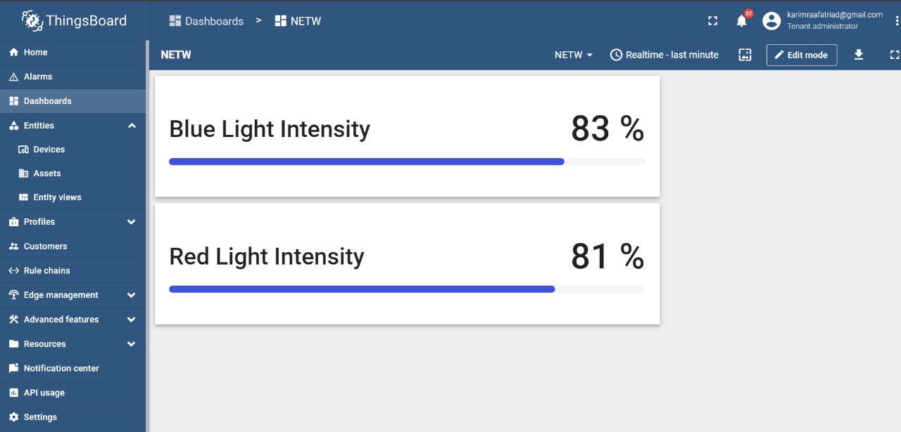

# Client-Server
The project was divided into four milestones, each focusing on different aspects of the client-server model. The milestones were designed to explore various ways of implementing and utilizing the client-server architecture.

# Project Description:

## Milestone 0:

In Milestone 0, the goal is to build a chatting application using a client-server model. The application should have the following features:
  1. The client can initiate a chat with the server at any time.
  2. The server responds by echoing the message sent by the client in capitalized format.
  3. The connection between the client and server remains open until the client sends a message containing "CLOSE SOCKET," upon which the connection is closed.
  4. The chat connections are based on the TCP protocol.
Note: The server should continue running even if a client terminates, allowing subsequent clients to connect and chat with the server in Milestone 1.

## Milestone 1: 

In Milestone 1, the objective is to extend the chatting application to support multiple clients and a single server. The application should have the following features:
  1. The server should be able to communicate with multiple clients concurrently using threading.
  2. The server should store client information such as connection socket and output stream using a suitable data structure (e.g., linked list, array).
  3. Each client can initiate a chat with the server at any time.
  4. The server responds by echoing the message sent by the corresponding client in capitalized format.
  5. The connection between a client and the server remains open until the client sends a message containing "CLOSE SOCKET," upon which the connection is closed.
  6. The chat connections continue to use the TCP protocol.
Note: You can use the provided client code or continue building upon the client code from Milestone 0. For the server side and implementing threading, you can refer to the provided hints or choose any other coding approach that you understand and prefer.

## Milestone 2: 

In Milestone 2, the project focuses on utilizing IoT and client-server communication to collect and analyze sensor data. The key points are as follows:
  1. The project involves using an ESP8266 Wi-Fi module as the client, which periodically sends sensor readings (such as temperature or light) to the server.
  2. Each team should have at least two ESP8266 modules functioning as clients, sending data to the server implemented in previous milestones.
  3. The clients should be able to send data (numbers or strings) to the server.
  4. The clients should periodically send data to the server.
  5. The server should be capable of communicating with multiple clients simultaneously, as in Milestone 1.
  6. Required materials include ESP8266 Wi-Fi modules, sensors (e.g., temperature or light sensors), Python IDE for the server, and Arduino IDE for programming the ESP8266 clients.
  7. The ESP8266 modules need to be connected to the Arduino IDE following specific steps, including installing the ESP8266 platform and selecting the NodeMCU 1.0 (ESP-12E Module) board.
Note: Milestone 2 focuses on establishing the communication between the ESP8266 clients and the server, with the clients sending sensor data periodically to be stored on the server for future analysis.

## Milestone 3: 

Milestone 3 requires the implementation of a complete IoT system by connecting the ESP8266 module to the ThingsBoard IoT platform. The main objective is to replace the Python server from the previous milestone with the ThingsBoard platform. The following requirements must be met:

  1. Sign up for a Community Edition Live Demo account on the ThingsBoard IoT platform. You can use this follow up link 
  https://thingsboard.io/installations/
  2. Send temperature readings obtained by the ESP8266 module to the ThingsBoard platform at a constant time interval (e.g., every 30 seconds).
  3. The ThingsBoard platform should monitor the temperature values sent from the ESP module.

To connect the ESP8266 with the ThingsBoard IoT platform, follow the steps outlined in the YouTube video provided in the link: https://www.youtube.com/watch?v=4xfKhU5U_ME.

Overall, the project explored different aspects of the client-server model, including basic communication, security, scalability, performance optimization, real-time updates, and error handling. Each milestone contributed to the development of a comprehensive and efficient client-server architecture.

# Here are some previews 

